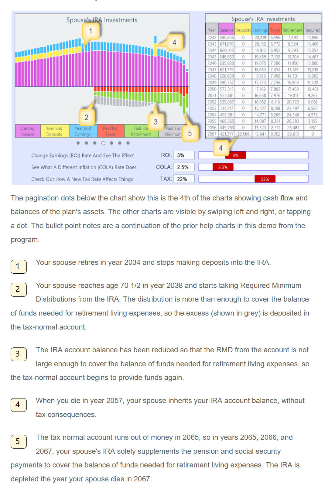

## GetRichDieBroke

The New York Times Business section on April 3, 2021, had an article in the "Your Money Advisor" column by Ann Carrns titled "Pandemic Spurs Interest in Teaching Financial Literacy".

The GetRichDieBroke program is perfect for teaching financial literacy.
It plots cash flow projections over time with interactive charts. It shows the compounding effects of earnings, taxes, and inflation on your money. On-screen sliders change those rates with immediate visual results.

Now I've posted the program as open source on GitHub with a MIT license.

Back when I was learning JS I found Danny Goodman's book "Dynamic HTML" from O'Reilly. It showed how to work with just HTML and produce a great app. That resource helped me write this interactive financial planning program as my first JS hobby project in 1998. This program is hosted at GetRichDieBroke.com.

You can run it locally by by following these instructions.

These instructions are for Windows.
The Mac should be the same, but I have not tested it there.

**Local Environment**

Clone the repo into a folder on your computer.

```
git clone https://github.com/martinduo/GetRichDieBroke.git
```

Install VS Code.

```
Download-
https://code.visualstudio.com/download

Start VS Code.

Under File/Open Folder...
select the folder holding the cloned repo.
```

In .vscode/launch.json, select the configuration shown below.

```
.vscode/
  launch.json/

   {
    "configurations": [
      {
        "type": "pwa-chrome",
        "request": "launch",
        "name": "Open index.html",
        "file": "c:<yourfilepath>GetRichDieBroke\\index.html"
      }
    ]
   }

```

Now hit f5 to run the repo version of the program on your browser.

**The Application**

The program is an easy to use teaching tool.

It runs on iPads, notebooks, and desktop computers.

None of the above setup is needed to use it.

Anyone can run it. It's already hosted on the Web.

```

Enter GetRichDieBroke.com in a browser.

```

The program has a Green Demo and a Red Demo.

Each is fully configured and has help charts.

This is one of the demo help charts


